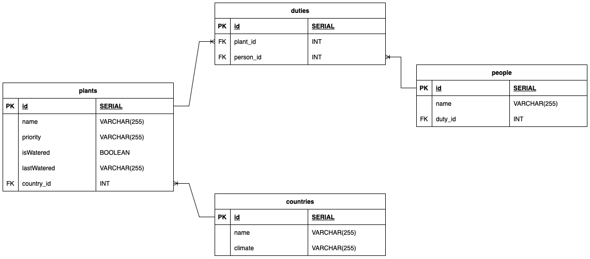
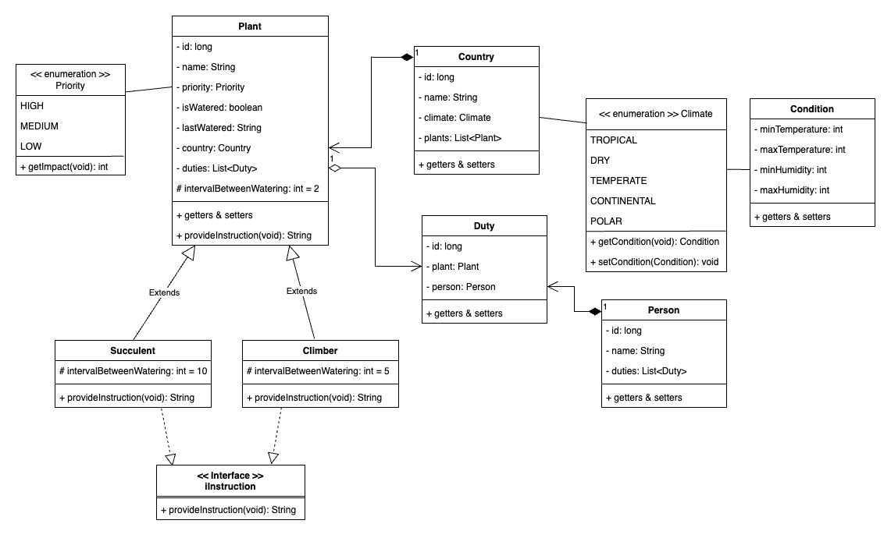

# Plant Tracker API

Create a Plant Tracker app, that will allow us to track when plants need to be watered, when they were last watered, who is responsible for the next watering. It will also contain interesting information about the plant’s needs/origins.

## Names and versions of libraries used

### Tools

- JavaSE 17
- SpringBoot 3.3.0
- Hibernate

### Dependencies

- Spring Web
- Spring Boot DevTools
- PostgreSQL Driver
- Spring Data JPA
- Java.util

## Setup instructions

1. install Postgres (via homebrew or [Postgresapp](www.postgresapp.com)).
2. create a database createdb `planttracker_db` in Terminal.
3. Install Java.
4. clone this [project](https://github.com/kandelrabin/plant_tracker_backend) to your computer and run main() in `PlantTrackerApplication`.
5. Import routes collection `api_plant_tracker.postman_collection.json` from repo to your Postman collection.
6. Run each endpoint to view the result.

## Diagrams

### Entity Relationship Diagram

### Class Diagram

## Routes

### 1.  Person

| METHOD | PATH/URL | NAME OF ACTION | RESULT | SAMPLE PAYLOAD | EXAMPLE RESPONSE |
|---|---|---|---|---|---|
| GET | localhost:8080/people | INDEX | Receive a list of people data | - | ` [{"id":1,"name":"aaron","duties":[{"id":1,"plant":{"id":1,"name":"Cactus","age":2,"priority":"LOW","lastWateredDates":[],"country":{"id":1,"name":"Egypt","climate":"DRY"},"intervalBetweenWatering":10}}]},{"id":2,"name":"kate","duties":[{"id":2,"plant":{"id":2,"name":"Daisy","age":1,"priority":"LOW","lastWateredDates":[],"country":{"id":2,"name":"USA","climate":"TROPICAL"},"intervalBetweenWatering":2}}]},{"id":3,"name":"dena","duties":[]},{"id":4,"name":"rabin","duties":[]}] ` |
| GET | localhost:8080/people/id | SHOW | Receive data of a single person | - | ` {"id":1,"name":"aaron","duties":[{"id":1,"plant":{"id":1,"name":"Cactus","age":2,"priority":"LOW","lastWateredDates":[],"country":{"id":1,"name":"Egypt","climate":"DRY"},"intervalBetweenWatering":10}}]} ` |
| POST | localhost:8080/people | CREATE | Create a person | ` {      "name" :  "Rabin" } ` | ` {"id":5,"name":"Rabin","duties":[]} ` |
| PATCH | localhost:8080/people/id | UPDATE | Update a person | ` {      "name"  :  "Dena" } ` | ` {"id":2,"name":"Dena","duties":[{"id":2,"plant":{"id":2,"name":"Daisy","age":1,"priority":"LOW","lastWateredDates":[],"country":{"id":2,"name":"USA","climate":"TROPICAL"},"intervalBetweenWatering":2}}]} ` |
| DELETE | localhost:8080/people/id | DELETE | Delete a person | - | - |

### 2.  Plant

| METHOD | PATH/URL | NAME OF ACTION | RESULT | SAMPLE PAYLOAD | EXAMPLE RESPONSE |
|---|---|---|---|---|---|
| GET | localhost:8080/plants | INDEX | Receive a list of plant data | - | ` [{"id":1,"name":"Cactus","age":2,"priority":"LOW","lastWateredDates":[],"country":{"id":1,"name":"Egypt","climate":"DRY"},"duties":[{"id":1,"person":{"id":1,"name":"aaron"}}],"intervalBetweenWatering":10},{"id":2,"name":"Daisy","age":1,"priority":"LOW","lastWateredDates":[],"country":{"id":2,"name":"USA","climate":"TROPICAL"},"duties":[{"id":2,"person":{"id":2,"name":"kate"}}],"intervalBetweenWatering":2},{"id":3,"name":"Jasmine","age":3,"priority":"HIGH","lastWateredDates":[],"country":{"id":2,"name":"USA","climate":"TROPICAL"},"duties":[],"intervalBetweenWatering":5},{"id":4,"name":"Rose","age":5,"priority":"HIGH","lastWateredDates":[],"country":{"id":2,"name":"USA","climate":"TROPICAL"},"duties":[],"intervalBetweenWatering":5}] ` |
| GET | localhost:8080/plants/id | SHOW | Receive data of a single plant | - | ` {"id":1,"name":"Cactus","age":2,"priority":"LOW","lastWateredDates":[],"country":{"id":1,"name":"Egypt","climate":"DRY"},"duties":[{"id":1,"person":{"id":1,"name":"aaron"}}],"intervalBetweenWatering":10} ` |
| POST | localhost:8080/plants | CREATE | Create a plant | ` { "name" :  "Rose" , "priority" :  "HIGH" , "countryId"  :  2 , "plantType" :  "Plant" } ` | ` [{"id":1,"name":"Cactus","age":2,"priority":"LOW","lastWateredDates":[],"country":{"id":1,"name":"Egypt","climate":"DRY"},"duties":[{"id":1,"person":{"id":1,"name":"aaron"}}],"intervalBetweenWatering":10},{"id":2,"name":"Daisy","age":1,"priority":"LOW","lastWateredDates":[],"country":{"id":2,"name":"USA","climate":"TROPICAL"},"duties":[{"id":2,"person":{"id":2,"name":"kate"}}],"intervalBetweenWatering":2},{"id":3,"name":"Jasmine","age":3,"priority":"HIGH","lastWateredDates":[],"country":{"id":2,"name":"USA","climate":"TROPICAL"},"duties":[],"intervalBetweenWatering":5},{"id":4,"name":"Rose","age":5,"priority":"HIGH","lastWateredDates":[],"country":{"id":2,"name":"USA","climate":"TROPICAL"},"duties":[],"intervalBetweenWatering":5},{"id":5,"name":"Rose","age":0,"priority":"HIGH","lastWateredDates":[],"country":{"id":2,"name":"USA","climate":"TROPICAL"},"duties":[],"intervalBetweenWatering":2}] ` |
| PATCH | localhost:8080/plants/id | PARTIAL UPDATE | Partially update a plant | ` { "countryId"  :  2 } ` | ` {"id":1,"name":"Cactus","age":2,"priority":"LOW","lastWateredDates":[],"country":{"id":2,"name":"USA","climate":"TROPICAL"},"duties":[{"id":1,"person":{"id":1,"name":"aaron"}}],"intervalBetweenWatering":10} ` |
| PUT | localhost:8080/plants/id | FULL UPDATE | Fully update a plant | ` { "name" :  "Sunflower" , "priority" :  "MEDIUM" , "lastWatered" :  "12/06/2024" , "countryId"  :  1 } ` | ` {"id":1,"name":"Sunflower","age":0,"priority":"MEDIUM","lastWateredDates":[],"country":{"id":1,"name":"Egypt","climate":"DRY"},"duties":[{"id":1,"person":{"id":1,"name":"aaron"}}],"intervalBetweenWatering":10} ` |
| DELETE | localhost:8080/plants/id | DELETE | Delete a plant | - | - |
| PATCH | localhost:8080/plants/id/water-plant | PARTIAL UPDATE (WATER) | Marks a plant as watered | - | ` {"id":2,"name":"Daisy","age":1,"priority":"LOW","lastWateredDates":["14/06/2024"],"country":{"id":2,"name":"USA","climate":"TROPICAL"},"duties":[{"id":2,"person":{"id":2,"name":"kate"}}],"intervalBetweenWatering":2} ` |
| GET | localhost:8080/plants/message/id | SHOW (PROVIDE INSTRUCTION) | Receive a string of a plant care instruction | - | `{"id":1,"instruction":"Best condition for succulents is [Min Temperature, Max Temperature]: 39, 70 ,[Min Humidity, Max Humidity]: 0, 21. The watering interval is 10. The watering priority is LOW. Watch out for the spikes."}` |
| GET | localhost:8080/plants/plant-info/id | SHOW (PLANT INFO) | Receive a string of plant information | - | `{"id":1,"plantInfo":"This Cactus is 2 year(s) old and it originates from Egypt. It has never been watered. See care instructions for how to look after this!"}` |
| GET | localhost:8080/plants/countdown/id | SHOW (COUNTDOWN) | Receive a string of countdown time until next watering date (Note: Water the plant at least once before running this) | - | `{"id":1,"countdown":"10"}` |

### 3. Country

| METHOD | PATH/URL | NAME OF ACTION | RESULT | SAMPLE PAYLOAD | EXAMPLE RESPONSE |
|---|---|---|---|---|---|
| GET | localhost:8080/countries | INDEX | Receive a list of country data | - | ` [{"id":1,"name":"Egypt","climate":"DRY","plants":[{"id":1,"name":"Cactus","age":2,"priority":"LOW","lastWateredDates":[],"duties":[{"id":1,"person":{"id":1,"name":"aaron"}}],"intervalBetweenWatering":10,"blooming":null}]},{"id":2,"name":"USA","climate":"TROPICAL","plants":[{"id":2,"name":"Daisy","age":1,"priority":"LOW","lastWateredDates":[],"duties":[{"id":2,"person":{"id":2,"name":"kate"}}],"intervalBetweenWatering":2},{"id":3,"name":"Jasmine","age":3,"priority":"HIGH","lastWateredDates":[],"duties":[],"intervalBetweenWatering":5,"blooming":null},{"id":4,"name":"Rose","age":5,"priority":"HIGH","lastWateredDates":[],"duties":[],"intervalBetweenWatering":5,"blooming":null}]},{"id":3,"name":"Netherlands","climate":"CONTINENTAL","plants":[]}] ` |
| GET | localhost:8080/countries/id | SHOW | Receive data of a single country | - | ` {"id":2,"name":"USA","climate":"TROPICAL","plants":[{"id":2,"name":"Daisy","age":1,"priority":"LOW","lastWateredDates":[],"duties":[{"id":2,"person":{"id":2,"name":"kate"}}],"intervalBetweenWatering":2},{"id":3,"name":"Jasmine","age":3,"priority":"HIGH","lastWateredDates":[],"duties":[{"id":3,"person":{"id":3,"name":"dena"}}],"intervalBetweenWatering":5,"blooming":null},{"id":4,"name":"Rose","age":5,"priority":"HIGH","lastWateredDates":[],"duties":[],"intervalBetweenWatering":5,"blooming":null}]} `  |
| POST | localhost:8080/countries | CREATE | Create a country | ` { "name" :  "India" , "climate" :  "TEMPERATE" } `  | ` {"id":4,"name":"India","climate":"TEMPERATE","plants":[]} ` |
| PATCH | localhost:8080/countries/id | PARTIAL UPDATE | Partially update a country | ` { "climate"  :  "TROPICAL" } ` | ` {"id":1,"name":"Egypt","climate":"TROPICAL","plants":[{"id":1,"name":"Cactus","age":2,"priority":"LOW","lastWateredDates":[],"duties":[{"id":1,"person":{"id":1,"name":"aaron"}}],"intervalBetweenWatering":10}]} `  |
| PUT | localhost:8080/countries/id | FULL UPDATE | Fully update a country | ` { "name" :  "Egypt" , "climate" :  "DRY" } ` | ` {"id":1,"name":"Egypt","climate":"DRY","plants":[{"id":1,"name":"Cactus","age":2,"priority":"LOW","lastWateredDates":[],"duties":[{"id":1,"person":{"id":1,"name":"aaron"}}],"intervalBetweenWatering":10}]} ` |
| DELETE | localhost:8080/countries/id | DELETE | Delete a country | - | - |

### 4. Duty

| METHOD | PATH/URL | NAME OF ACTION | RESULT | SAMPLE PAYLOAD | EXAMPLE RESPONSE |
|---|---|---|---|---|---|
| GET | localhost:8080/duties | INDEX | Receive a list of duty data | - | ` [{"id":1,"plant":{"id":1,"name":"Cactus","age":2,"priority":"LOW","lastWateredDates":[],"country":{"id":1,"name":"Egypt","climate":"DRY"},"intervalBetweenWatering":10},"person":{"id":1,"name":"aaron"}},{"id":2,"plant":{"id":2,"name":"Daisy","age":1,"priority":"LOW","lastWateredDates":[],"country":{"id":2,"name":"USA","climate":"TROPICAL"},"intervalBetweenWatering":2},"person":{"id":2,"name":"kate"}}] ` |
| GET | localhost:8080/duties/id | SHOW | Receive data of a single duty | - | ` {"id":1,"plant":{"id":1,"name":"Cactus","age":2,"priority":"LOW","lastWateredDates":[],"country":{"id":1,"name":"Egypt","climate":"DRY"},"intervalBetweenWatering":10},"person":{"id":1,"name":"aaron"}} ` |
| POST | localhost:8080/duties | CREATE | Create a duty | ` {      "plantId" : 3 ,      "personId" : 3 } ` | ` {"id":3,"plant":{"id":3,"name":"Jasmine","age":3,"priority":"HIGH","lastWateredDates":[],"country":{"id":2,"name":"USA","climate":"TROPICAL"},"intervalBetweenWatering":5},"person":{"id":3,"name":"dena"}} ` |
| PATCH | localhost:8080/duties/id | PARTIAL UPDATE | Partially update a duty | ` {      "personId" : 2 } ` | ` {"id":1,"plant":{"id":1,"name":"Cactus","age":2,"priority":"LOW","lastWateredDates":[],"country":{"id":1,"name":"Egypt","climate":"DRY"},"intervalBetweenWatering":10},"person":{"id":2,"name":"kate"}} ` |
| PUT | localhost:8080/duties/id | FULL UPDATE | Fully update a duty | ` {      "plantId" : 3 ,      "personId" : 1 } ` | ` {"id":2,"plant":{"id":3,"name":"Jasmine","age":3,"priority":"HIGH","lastWateredDates":[],"country":{"id":2,"name":"USA","climate":"TROPICAL"},"intervalBetweenWatering":5},"person":{"id":1,"name":"aaron"}} ` |
| DELETE | localhost:8080/duties/id | DELETE | Delete a duty | - | - |

## MVP
* Create `Plant` model with following properties and getters and setters for each one:
	* 	`id`
	*  `name`
	*  `priority`
	*  `lasWatered`
	*  `country`
	*  `duties`
	*  `intervalBetweenWatering`
*  Create `Country` model with following properties and getters and setters for each one:
	* `id`
	* `name`
	* `climate` is of enummeration type `Climate` with following values
		* `TROPICAL`
		* `DRY`
		* `TEMPERATE`
		* `CONTINENTAL`
		* `POLAR`
	* `plants`
	
	> `Climate` enumeration uses instance of`Condition` class as a value. 
	
*  Create `Duty` model with following properties and getters and setters for each one:
	*  `id`
	*  `plant`
	*  `person`
*  Create `Person` model with following properties and getters and setters for each one:
	*  `id`
	*  `name`
	*  `duties`

* Create `PlantService` in services package with following methods:
	* `provideInstruction(long): String`
	* `waterPlant(long): Plant`
	* `plantInformation(long): String`
	* `addNewPlant(PlantDTO): Plant `
	* `getPlantById(long): Optional<Plant>`
	* `updatePlantPartial(long, Map< String, String>): Plant`
	* `updatePlantFull(Long, PlantDTO): Plant`
	* `deletePlant(long): void`
* Create `CountryService` in services package with following methods:
	* `addNewCountry(CountryDTO): Country`
	* `getCountryById(long): Optional<Country>`
	* `getAllCountries(void): List<Country>`
	* `updateCountryName(long, String): Country`
	* `updateCountryClimate(long, Climate): Country`
	* `fullUpdateCountry(CountryDTO, long): Country`
	* `deleteCountry(long): void`
	* `deletePlantFromCountry(long): void`
* Create `DutyService` in services package with following methods:
	* `addNewDuty(DutyDTO): Duty`
	* `getAllDuties(void): List<Duty>`
	* `getDutyById(long): Optional<Duty>`
	* `updateDutyPlant(long, long): Duty`
	* `updateDutyPerson(long, long): Duty`
	* `updateDutyFull(long, long, long): Duty`
	* `deleteDuty(long): void`
* Create `PersonService` in service package with following methods:
	* `addNewPerson(String): Person `
	* `getPersonById(long): Optional<Person>`
	* ` getAllPeople(void): List<Person>`
	* `updatePerson(long, String): Person`
	* `deletePerson(long): void`
* Create `PersonRepository`, `PlantRepository`, `CountryRepository` and `DutyRepository` in repositories package.

* Create `PersonController`, `PlantController`, `CountryController` and `DutyController` in controllers package. Each controller must contain the routes displayed in the **Routes table** above.
	
	

## Extension

* Add a feature to display countdown time ie. the number of days until next watering date.
	* `getCountdownTime(long): String`
* Refactor `DutyService` and `DutyController` to prevent adding duty if a person or a plant already exist in a duties table. Following methods for `DutyService`:
	* `personExists(long): boolean`
	* `plantExists(long): boolean`

> `DutyRepository` should contain following derived queries:
> 
> 	* `findAllByPersonId(Long): List<Duty>` 
> 	* `findAllByPlantId(Long): List<Duty>`
